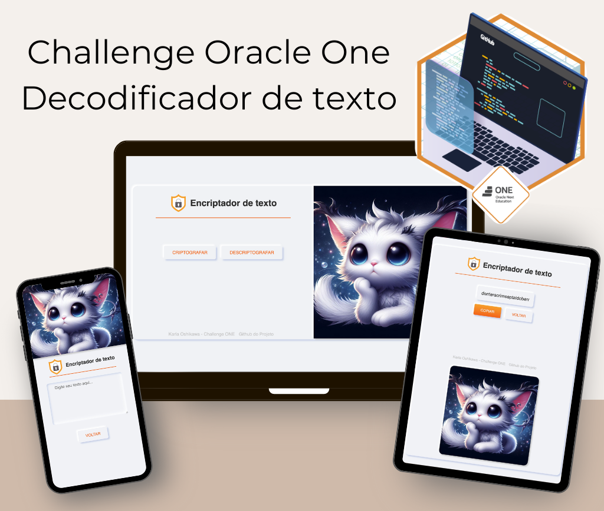

  

# Challenge Oracle One - Decodificador de texto

 Aplicação que criptografa textos, assim você poderá trocar mensagens secretas com outras pessoas que saibam o segredo da criptografia utilizada.

As "chaves" de criptografia que utilizaremos são:
- A letra "a" é convertida para "ai"
- A letra "e" é convertida para "enter"
- A letra "i" é convertida para "imes"
- A letra "o" é convertida para "ober"
- A letra "u" é convertida para "ufat"

Requisitos:
- Deve funcionar apenas com letras minúsculas
- Não devem ser utilizados letras com acentos nem caracteres especiais
- Deve ser possível converter uma palavra para a versão criptografada e também retornar uma palavra criptografada para a versão original.

Por exemplo:
* "gato" => "gaitober"
* gaitober" => "gato"

A página deve ter campos para inserção do texto a ser criptografado ou descriptografado, e a pessoa usuária deve poder escolher entre as duas opções
O resultado deve ser exibido na tela.

Fiz um layout pernalizado. Ao invés de pedir que o usuário digite apenas em letra minúscula e sem acento, estou tratando o texto no código.

- [Figma proposto pelo desafio](https://www.figma.com/file/tvFEYhVfZTjdJ5P24RGV21/Alura-Challenge---Desafio-1---L%C3%B3gica?type=design&node-id=16-802&mode=design&t=2yW8MGRi9cDUPxwa-0)

## 🔗 Deploy & Preview

- [Deploy Github Pages](https://karlaoshikawa.github.io/alura-one-encriptador/)

  

## ⚙️  Stacks
HTML | CSS | JS
###### obs: Foi um bom exercício de volta as origens para treinar sem usar frameworks, bibliotecas e compiladores.

## 💌  Autora

### Karla Oshikawa

[Linkedin](https://www.linkedin.com/in/karlaoshikawa/) | [Instagram](https://www.instagram.com/karla.oshikawa/)

